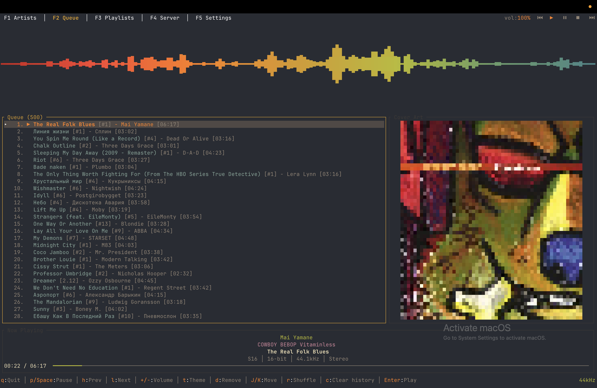

# Ferrosonic

A terminal-based Subsonic music client written in Rust, featuring bit-perfect audio playback, gapless transitions, and full desktop integration.



Ferrosonic is inspired by [Termsonic](https://git.sixfoisneuf.fr/termsonic/about/), the original terminal Subsonic client written in Go by [SixFoisNeuf](https://www.sixfoisneuf.fr/posts/termsonic-a-terminal-client-for-subsonic/). Ferrosonic is a ground-up rewrite in Rust with additional features including PipeWire sample rate switching for bit-perfect audio, MPRIS2 media controls, multiple color themes, and mouse support.

## Features

- **Bit-perfect audio** - Automatic PipeWire sample rate switching to match the source material (44.1kHz, 48kHz, 96kHz, 192kHz, etc.)
- **Gapless playback** - Seamless transitions between tracks with pre-buffered next track
- **MPRIS2 integration** - Full desktop media control support (play, pause, stop, next, previous, seek)
- **Artist/album browser** - Tree-based navigation with expandable artists and album listings
- **Playlist support** - Browse and play server playlists with shuffle capability
- **Play queue management** - Add, remove, reorder, shuffle, and clear queue history
- **Audio quality display** - Real-time display of sample rate, bit depth, codec format, and channel layout
- **Audio visualizer** - Integrated cava audio visualizer with theme-matched gradient colors
- **13 built-in themes** - Default, Monokai, Dracula, Nord, Gruvbox, Catppuccin, Solarized, Tokyo Night, Rosé Pine, Everforest, Kanagawa, One Dark, and Ayu Dark
- **Custom themes** - Create your own themes as TOML files in `~/.config/ferrosonic/themes/`
- **Mouse support** - Clickable buttons, tabs, lists, and progress bar seeking
- **Artist filtering** - Real-time search/filter on the artist list
- **Multi-disc album support** - Proper disc and track number display
- **Keyboard-driven** - Vim-style navigation (j/k) alongside arrow keys

## Installation

### Dependencies

Ferrosonic requires the following at runtime:

| Dependency | Purpose | Required |
|---|---|---|
| **mpv** | Audio playback engine (via JSON IPC) | Yes |
| **PipeWire** | Automatic sample rate switching for bit-perfect audio | Recommended |
| **WirePlumber** | PipeWire session manager | Recommended |
| **D-Bus** | MPRIS2 desktop media controls | Recommended |
| **cava** | Audio visualizer | Optional |

### macOS

Install dependencies via Homebrew, then download the latest precompiled binary:

```bash
brew install mpv cava
```
Then build from source

### Quick Install

Supports Arch, Fedora, and Debian/Ubuntu. Installs runtime dependencies, downloads the latest precompiled binary, and installs to `/usr/local/bin/`:

```bash
curl -sSf https://raw.githubusercontent.com/jaidaken/ferrosonic/master/install.sh | sh
```

### Build from Source

If you prefer to build from source, you'll also need: Rust toolchain, pkg-config, OpenSSL dev headers, and D-Bus dev headers. Then:

```bash
git clone https://github.com/jaidaken/ferrosonic.git
cd ferrosonic
cargo build --release
sudo cp target/release/ferrosonic /usr/local/bin/
```

## Usage

```bash
# Run with default config (~/.config/ferrosonic/config.toml)
ferrosonic

# Run with a custom config file
ferrosonic -c /path/to/config.toml

# Enable verbose/debug logging
ferrosonic -v
```

## Configuration

Configuration is stored at `~/.config/ferrosonic/config.toml`. You can edit it manually or configure the server connection through the application's Server page (F4).

```toml
BaseURL = "https://your-subsonic-server.com"
Username = "your-username"
Password = "your-password"
Theme = "Default"
```

| Field | Description |
|---|---|
| `BaseURL` | URL of your Subsonic-compatible server (Navidrome, Airsonic, Gonic, etc.) |
| `Username` | Your server username |
| `Password` | Your server password |
| `Theme` | Color theme name (e.g. `Default`, `Catppuccin`, `Tokyo Night`) |

Logs are written to `~/.config/ferrosonic/ferrosonic.log`.

## Keyboard Shortcuts

### Global

| Key | Action |
|---|---|
| `q` | Quit |
| `p` / `Space` | Toggle play/pause |
| `l` | Next track |
| `h` | Previous track |
| `Ctrl+R` | Refresh data from server |
| `t` | Cycle to next theme |
| `F1` | Artists page |
| `F2` | Queue page |
| `F3` | Playlists page |
| `F4` | Server configuration page |
| `F5` | Settings page |

### Artists Page (F1)

| Key | Action |
|---|---|
| `/` | Filter artists by name |
| `Esc` | Clear filter |
| `Up` / `k` | Move selection up |
| `Down` / `j` | Move selection down |
| `Left` / `Right` | Switch focus between tree and song list |
| `Enter` | Expand/collapse artist, or play album/song |
| `Backspace` | Return to tree from song list |
| `e` | Add selected item to end of queue |
| `n` | Add selected item as next in queue |

### Queue Page (F2)

| Key | Action |
|---|---|
| `Up` / `k` | Move selection up |
| `Down` / `j` | Move selection down |
| `Enter` | Play selected song |
| `d` | Remove selected song from queue |
| `J` (Shift+J) | Move selected song down |
| `K` (Shift+K) | Move selected song up |
| `r` | Shuffle queue (current song stays in place) |
| `c` | Clear played history (remove songs before current) |

### Playlists Page (F3)

| Key | Action |
|---|---|
| `Tab` / `Left` / `Right` | Switch focus between playlists and songs |
| `Up` / `k` | Move selection up |
| `Down` / `j` | Move selection down |
| `Enter` | Load playlist songs or play selected song |
| `e` | Add selected item to end of queue |
| `n` | Add selected song as next in queue |
| `r` | Shuffle play all songs in selected playlist |

### Server Page (F4)

| Key | Action |
|---|---|
| `Tab` | Move between fields |
| `Enter` | Test connection or Save configuration |
| `Backspace` | Delete character in text field |

### Settings Page (F5)

| Key | Action |
|---|---|
| `Up` / `Down` | Move between settings |
| `Left` | Previous option |
| `Right` / `Enter` | Next option |

Settings include theme selection and cava visualizer toggle. Changes are saved automatically.

## Mouse Support

- Click page tabs in the header to switch pages
- Click playback control buttons (Previous, Play, Pause, Stop, Next) in the header
- Click items in lists to select them
- Click the progress bar in the Now Playing widget to seek

## Audio Features

### Bit-Perfect Playback

Ferrosonic uses PipeWire's `pw-metadata` to automatically switch the system sample rate to match the source material. When a track at 96kHz starts playing, PipeWire is instructed to output at 96kHz, avoiding unnecessary resampling. The original sample rate is restored when the application exits.

### Gapless Playback

The next track in the queue is pre-loaded into MPV's internal playlist before the current track finishes, allowing seamless transitions with no gap or click between songs.

### Now Playing Display

The Now Playing widget shows:
- Artist, album, and track title
- Audio quality: format/codec, bit depth, sample rate, and channel layout
- Visual progress bar with elapsed/total time

## Themes

Ferrosonic ships with 13 themes. On first run, the built-in themes are written as TOML files to `~/.config/ferrosonic/themes/`.

| Theme | Description |
|---|---|
| **Default** | Cyan/yellow on dark background (hardcoded) |
| **Monokai** | Classic Monokai syntax highlighting palette |
| **Dracula** | Purple/pink Dracula color scheme |
| **Nord** | Arctic blue Nord palette |
| **Gruvbox** | Warm retro Gruvbox colors |
| **Catppuccin** | Soothing pastel Catppuccin Mocha palette |
| **Solarized** | Ethan Schoonover's Solarized Dark |
| **Tokyo Night** | Dark Tokyo Night color scheme |
| **Rosé Pine** | Soho vibes Rosé Pine palette |
| **Everforest** | Comfortable green Everforest Dark |
| **Kanagawa** | Dark Kanagawa wave palette |
| **One Dark** | Atom One Dark color scheme |
| **Ayu Dark** | Ayu Dark color scheme |

Change themes with `t` from any page, from the Settings page (F5), or by editing the `Theme` field in `config.toml`.

### Custom Themes

Create a `.toml` file in `~/.config/ferrosonic/themes/` and it will appear in the theme list. The filename becomes the display name (e.g. `my-theme.toml` becomes "My Theme").

```toml
[colors]
primary = "#89b4fa"
secondary = "#585b70"
accent = "#f9e2af"
artist = "#a6e3a1"
album = "#f5c2e7"
song = "#94e2d5"
muted = "#6c7086"
highlight_bg = "#45475a"
highlight_fg = "#cdd6f4"
success = "#a6e3a1"
error = "#f38ba8"
playing = "#f9e2af"
played = "#6c7086"
border_focused = "#89b4fa"
border_unfocused = "#45475a"

[cava]
gradient = ["#a6e3a1", "#94e2d5", "#89dceb", "#74c7ec", "#cba6f7", "#f5c2e7", "#f38ba8", "#f38ba8"]
horizontal_gradient = ["#f38ba8", "#eba0ac", "#fab387", "#f9e2af", "#a6e3a1", "#94e2d5", "#89b4fa", "#cba6f7"]
```

You can also edit the built-in theme files to customize them. They will not be overwritten unless deleted.

## Compatible Servers

Ferrosonic works with any server implementing the Subsonic API, including:

- [Navidrome](https://www.navidrome.org/)
- [Airsonic](https://airsonic.github.io/)
- [Airsonic-Advanced](https://github.com/airsonic-advanced/airsonic-advanced)
- [Gonic](https://github.com/sentriz/gonic)
- [Supysonic](https://github.com/spl0k/supysonic)

## Acknowledgements

Ferrosonic is inspired by [Termsonic](https://git.sixfoisneuf.fr/termsonic/about/) by SixFoisNeuf, a terminal Subsonic client written in Go. Ferrosonic builds on that concept with a Rust implementation, bit-perfect audio via PipeWire, and additional features.

## License

MIT
